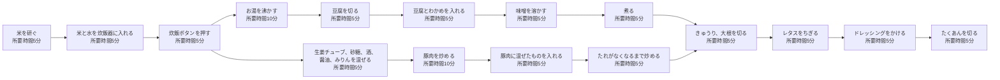

```mermaid
flowchart LR
    id8[生姜チューブ、砂糖、酒、醤油、みりんを混ぜる
    所要時間5分]
    id9[豚肉を炒める
    所要時間10分]
    id10[豚肉に混ぜたものを入れる
    所要時間5分]
    id11[たれがなくなるまで炒める
    所要時間5分]
    id12[きゅうり、大根を切る
    所要時間5分]
    id13[レタスをちぎる
    所要時間5分]
    id14[ドレッシングをかける
    所要時間5分]
    id15[お湯を沸かす
    所要時間10分]
    id16[豆腐を切る
    所要時間5分]
    id17[豆腐とわかめを入れる
    所要時間5分]
    id18[味噌を溶かす
    所要時間5分]
    id19[煮る
    所要時間5分]
    id20[米を研ぐ
    所要時間5分]
    id21[米と水を炊飯器に入れる
    所要時間5分]
    id22[炊飯ボタンを押す
    所要時間5分]
    id23[たくあんを切る
    所要時間5分]

    id20-->id21
    id21-->id22
    id22-->id8
    id8-->id9
    id9-->id10
    id10-->id11
    id22-->id15
    id15-->id16
    id16-->id17
    id17-->id18
    id18-->id19
    id19-->id12
    id11-->id12
    id12-->id13
    id13-->id14
    id14-->id23

```