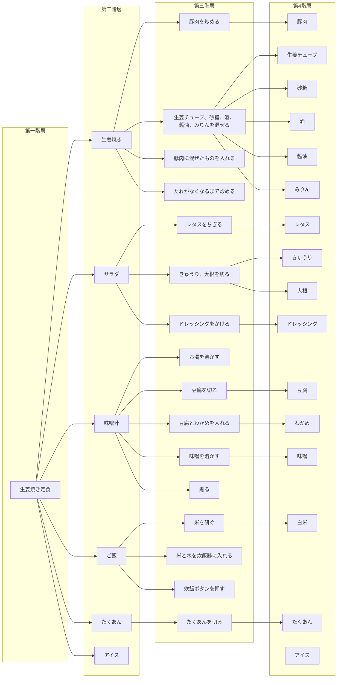

```mermaid
flowchart LR
    subgraph 第一階層
        id1[生姜焼き定食]
    end

    subgraph 第二階層
        id2[生姜焼き]
        id3[サラダ]
        id4[味噌汁]
        id5[ご飯]
        id6[たくあん]
        id7[アイス]
    end

    subgraph 第三階層
        id8[生姜チューブ、砂糖、酒、醤油、みりんを混ぜる]
        id9[豚肉を炒める]
        id10[豚肉に混ぜたものを入れる]
        id11[たれがなくなるまで炒める]

        id12[きゅうり、大根を切る]
        id13[レタスをちぎる]
        id14[ドレッシングをかける]

        id15[お湯を沸かす]
        id16[豆腐を切る]
        id17[豆腐とわかめを入れる]
        id18[味噌を溶かす]
        id19[煮る]

        id20[米を研ぐ]
        id21[米と水を炊飯器に入れる]
        id22[炊飯ボタンを押す]  

        id23[たくあんを切る]
    end

    subgraph 第4階層
        id24[豚肉]
        id25[生姜チューブ]
        id26[砂糖]
        id27[酒]
        id28[醤油]
        id29[みりん]

        id30[レタス]
        id31[きゅうり]
        id32[大根]
        id33[ドレッシング]

        id34[豆腐]
        id35[わかめ]
        id36[味噌]

        id37[白米]

        id38[たくあん]

        id39[アイス]
    end

    id1 --> id2
    id1 --> id3
    id1 --> id4
    id1 --> id5
    id1 --> id6
    id1 --> id7

    id2 --> id8
    id2 --> id9
    id2 --> id10
    id2 --> id11

    id3 --> id12
    id3 --> id13
    id3 --> id14

    id4 --> id15
    id4 --> id16
    id4 --> id17
    id4 --> id18
    id4 --> id19

    id5 --> id20
    id5 --> id21
    id5 --> id22

    id6 --> id23

    id8 --> id25
    id8 --> id26
    id8 --> id27
    id8 --> id28
    id8 --> id29
    id9 --> id24

    id12 --> id31
    id12 --> id32
    id13 --> id30
    id14 --> id33

    id16 --> id34
    id17 --> id35
    id18 --> id36

    id20 --> id37

    id23 --> id38
```